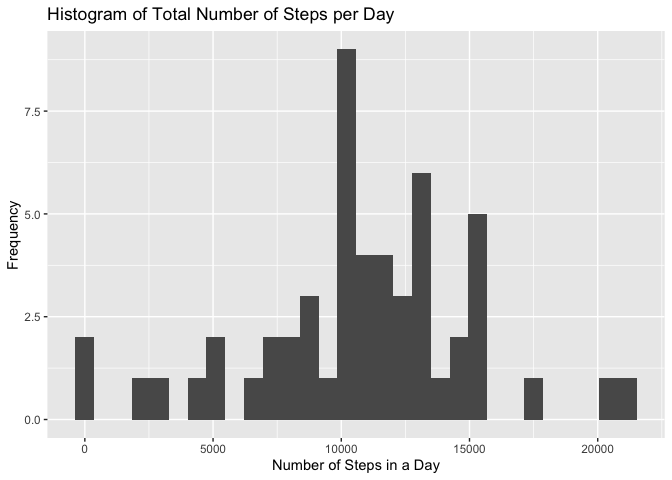
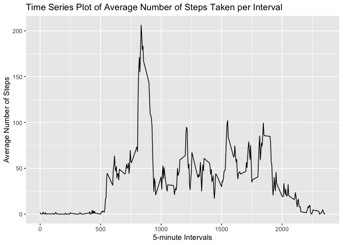
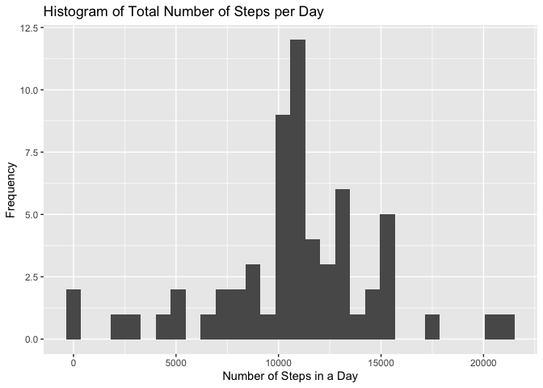
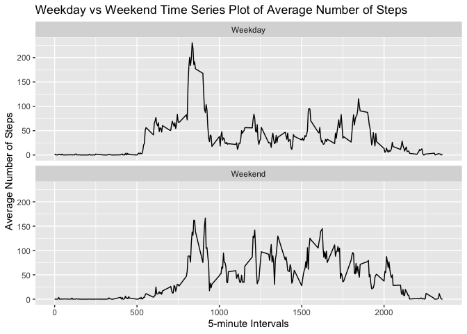

Set global options

    knitr::opts_chunk$set(echo = TRUE)

Load basic packages

    library(ggplot2)
    library(dplyr)

    ## 
    ## Attaching package: 'dplyr'

    ## The following objects are masked from 'package:stats':
    ## 
    ##     filter, lag

    ## The following objects are masked from 'package:base':
    ## 
    ##     intersect, setdiff, setequal, union

    library(lattice)

Loading and preprocessing the data
----------------------------------

1.  Code for reading the dataset and/or processing the data.

<!-- -->

    unzip("activity.zip")
    data <- read.table("activity.csv", sep = ",", header = TRUE, na.strings = "NA", colClasses = c("numeric", "Date", "factor"))

Observe the dataset

    head(data)

    ##   steps       date interval
    ## 1    NA 2012-10-01        0
    ## 2    NA 2012-10-01        5
    ## 3    NA 2012-10-01       10
    ## 4    NA 2012-10-01       15
    ## 5    NA 2012-10-01       20
    ## 6    NA 2012-10-01       25

    summary(data)

    ##      steps             date               interval    
    ##  Min.   :  0.00   Min.   :2012-10-01   0      :   61  
    ##  1st Qu.:  0.00   1st Qu.:2012-10-16   10     :   61  
    ##  Median :  0.00   Median :2012-10-31   100    :   61  
    ##  Mean   : 37.38   Mean   :2012-10-31   1000   :   61  
    ##  3rd Qu.: 12.00   3rd Qu.:2012-11-15   1005   :   61  
    ##  Max.   :806.00   Max.   :2012-11-30   1010   :   61  
    ##  NA's   :2304                          (Other):17202

Tidy the data

    data1 <- na.omit(data)
    data1$date <- as.Date(data1$date, format = "%Y-%m-%d")
    str(data1)

    ## 'data.frame':    15264 obs. of  3 variables:
    ##  $ steps   : num  0 0 0 0 0 0 0 0 0 0 ...
    ##  $ date    : Date, format: "2012-10-02" "2012-10-02" ...
    ##  $ interval: Factor w/ 288 levels "0","10","100",..: 1 226 2 73 136 195 198 209 212 223 ...
    ##  - attr(*, "na.action")= 'omit' Named int [1:2304] 1 2 3 4 5 6 7 8 9 10 ...
    ##   ..- attr(*, "names")= chr [1:2304] "1" "2" "3" "4" ...

What is the mean total number of steps taken per day
----------------------------------------------------

Calculate the total number of steps taken per day (omit NA values).

    totalsteps <- aggregate(steps ~ date, data1, sum)
    print(totalsteps)

    ##          date steps
    ## 1  2012-10-02   126
    ## 2  2012-10-03 11352
    ## 3  2012-10-04 12116
    ## 4  2012-10-05 13294
    ## 5  2012-10-06 15420
    ## 6  2012-10-07 11015
    ## 7  2012-10-09 12811
    ## 8  2012-10-10  9900
    ## 9  2012-10-11 10304
    ## 10 2012-10-12 17382
    ## 11 2012-10-13 12426
    ## 12 2012-10-14 15098
    ## 13 2012-10-15 10139
    ## 14 2012-10-16 15084
    ## 15 2012-10-17 13452
    ## 16 2012-10-18 10056
    ## 17 2012-10-19 11829
    ## 18 2012-10-20 10395
    ## 19 2012-10-21  8821
    ## 20 2012-10-22 13460
    ## 21 2012-10-23  8918
    ## 22 2012-10-24  8355
    ## 23 2012-10-25  2492
    ## 24 2012-10-26  6778
    ## 25 2012-10-27 10119
    ## 26 2012-10-28 11458
    ## 27 2012-10-29  5018
    ## 28 2012-10-30  9819
    ## 29 2012-10-31 15414
    ## 30 2012-11-02 10600
    ## 31 2012-11-03 10571
    ## 32 2012-11-05 10439
    ## 33 2012-11-06  8334
    ## 34 2012-11-07 12883
    ## 35 2012-11-08  3219
    ## 36 2012-11-11 12608
    ## 37 2012-11-12 10765
    ## 38 2012-11-13  7336
    ## 39 2012-11-15    41
    ## 40 2012-11-16  5441
    ## 41 2012-11-17 14339
    ## 42 2012-11-18 15110
    ## 43 2012-11-19  8841
    ## 44 2012-11-20  4472
    ## 45 2012-11-21 12787
    ## 46 2012-11-22 20427
    ## 47 2012-11-23 21194
    ## 48 2012-11-24 14478
    ## 49 2012-11-25 11834
    ## 50 2012-11-26 11162
    ## 51 2012-11-27 13646
    ## 52 2012-11-28 10183
    ## 53 2012-11-29  7047

Create a histogram of a total number of steps taken each day.

    histplot <- ggplot(totalsteps, aes(steps)) + 
              geom_histogram() +
              xlab("Number of Steps in a Day") + 
              ylab("Frequency") +
              ggtitle("Histogram of Total Number of Steps per Day")
    print(histplot)

    ## `stat_bin()` using `bins = 30`. Pick better value with `binwidth`.

Calculate and report the mean and median of the total number of steps
taken per day

    mean <- mean(totalsteps$steps, na.rm = TRUE) 

    median <- median(totalsteps$steps, na.rm = TRUE)

The mean is 1.076618910^{4} and the media is 1.076510^{4}.

What is the average daily activity pattern?
-------------------------------------------

Create a data frame consisting of the average number of steps for each
interval.

    intstep <- aggregate(data1$steps, list(interval = as.numeric(as.character(data1$interval))), FUN = mean)
    names(intstep)[2] <- "average_steps"

Plot the a time series plot the the dataframe.

    timeplot <- ggplot(intstep, aes(interval, average_steps)) +
              geom_line() +
              xlab("5-minute Intervals") + 
              ylab("Average Number of Steps") +
              ggtitle("Time Series Plot of Average Number of Steps Taken per Interval")
    print(timeplot)

    max <- intstep[which.max(intstep$average_steps),]

The 835th interval has the maximum average step of 206.1698113.

Imputing missing values
-----------------------

    miss <- sum(is.na(data))

There is a total of 2304 missing observations in the data.

Create a data frame where the NA values are replaced with the mean
values for that interval.

    filldata <- data
    for (i in 1:nrow(filldata)) {
              if(is.na(filldata$steps[i])) {
                        filldata$steps[i] <- intstep[which(filldata$interval[i] == intstep$interval), ]$average_steps
              }
    }

Validate that all NA values have been replaced.

    miss2 <- sum(is.na(filldata))

There is a total of 0 missing observations in the data.

Calculate the total number of steps taken per day with replaced NA
values.

    totalsteps2 <- aggregate(steps ~ date, filldata, sum)
    print(totalsteps2)

    ##          date    steps
    ## 1  2012-10-01 10766.19
    ## 2  2012-10-02   126.00
    ## 3  2012-10-03 11352.00
    ## 4  2012-10-04 12116.00
    ## 5  2012-10-05 13294.00
    ## 6  2012-10-06 15420.00
    ## 7  2012-10-07 11015.00
    ## 8  2012-10-08 10766.19
    ## 9  2012-10-09 12811.00
    ## 10 2012-10-10  9900.00
    ## 11 2012-10-11 10304.00
    ## 12 2012-10-12 17382.00
    ## 13 2012-10-13 12426.00
    ## 14 2012-10-14 15098.00
    ## 15 2012-10-15 10139.00
    ## 16 2012-10-16 15084.00
    ## 17 2012-10-17 13452.00
    ## 18 2012-10-18 10056.00
    ## 19 2012-10-19 11829.00
    ## 20 2012-10-20 10395.00
    ## 21 2012-10-21  8821.00
    ## 22 2012-10-22 13460.00
    ## 23 2012-10-23  8918.00
    ## 24 2012-10-24  8355.00
    ## 25 2012-10-25  2492.00
    ## 26 2012-10-26  6778.00
    ## 27 2012-10-27 10119.00
    ## 28 2012-10-28 11458.00
    ## 29 2012-10-29  5018.00
    ## 30 2012-10-30  9819.00
    ## 31 2012-10-31 15414.00
    ## 32 2012-11-01 10766.19
    ## 33 2012-11-02 10600.00
    ## 34 2012-11-03 10571.00
    ## 35 2012-11-04 10766.19
    ## 36 2012-11-05 10439.00
    ## 37 2012-11-06  8334.00
    ## 38 2012-11-07 12883.00
    ## 39 2012-11-08  3219.00
    ## 40 2012-11-09 10766.19
    ## 41 2012-11-10 10766.19
    ## 42 2012-11-11 12608.00
    ## 43 2012-11-12 10765.00
    ## 44 2012-11-13  7336.00
    ## 45 2012-11-14 10766.19
    ## 46 2012-11-15    41.00
    ## 47 2012-11-16  5441.00
    ## 48 2012-11-17 14339.00
    ## 49 2012-11-18 15110.00
    ## 50 2012-11-19  8841.00
    ## 51 2012-11-20  4472.00
    ## 52 2012-11-21 12787.00
    ## 53 2012-11-22 20427.00
    ## 54 2012-11-23 21194.00
    ## 55 2012-11-24 14478.00
    ## 56 2012-11-25 11834.00
    ## 57 2012-11-26 11162.00
    ## 58 2012-11-27 13646.00
    ## 59 2012-11-28 10183.00
    ## 60 2012-11-29  7047.00
    ## 61 2012-11-30 10766.19

Create a histogram with the updated data frame.

    histplot2 <- ggplot(totalsteps2, aes(steps)) + 
              geom_histogram() +
              xlab("Number of Steps in a Day") + 
              ylab("Frequency") +
              ggtitle("Histogram of Total Number of Steps per Day")
    print(histplot2)

    ## `stat_bin()` using `bins = 30`. Pick better value with `binwidth`.

 Calculate
and report the mean and median of the total number of steps taken per
day

    mean2 <- mean(totalsteps2$steps, na.rm = TRUE) 

    median2 <- median(totalsteps2$steps, na.rm = TRUE)

The mean is 1.076618910^{4} and the media is 1.076618910^{4}.

Are there differences in activity patterns between weekdays and weekends?
-------------------------------------------------------------------------

Add weekday information to the data frame.

    filldata$weekdays <- factor(format(filldata$date, "%A"))
    levels(filldata$weekdays)

    ## [1] "Friday"    "Monday"    "Saturday"  "Sunday"    "Thursday"  "Tuesday"  
    ## [7] "Wednesday"

Split the weekday column into “Weekday” and “Weekend” lists.

    levels(filldata$weekdays) <- list(Weekday = c("Monday", "Tuesday", "Wednesday",
                                                  "Thursday", "Friday"),
                                      Weekend = c("Saturday", "Sunday"))
    levels(filldata$weekdays)

    ## [1] "Weekday" "Weekend"

Create a data frame consisting of the average number of steps for each
interval.

    intstep2 <- aggregate(filldata$steps, list(interval = as.numeric(as.character(filldata$interval)),
                                               weekdays = filldata$weekdays), FUN = mean)
    names(intstep2)[3] <- "average_steps"

Create a panel plot containing a times series plot on the average number
of steps take across weekdays and weekends.

    timeplot2 <- ggplot(intstep2, aes(interval, average_steps)) +
              geom_line() +
              facet_wrap(~ weekdays, nrow = 2, ncol = 1) +
              xlab("5-minute Intervals") + 
              ylab("Average Number of Steps") +
              ggtitle("Weekday vs Weekend Time Series Plot of Average Number of Steps")
    print(timeplot2)

